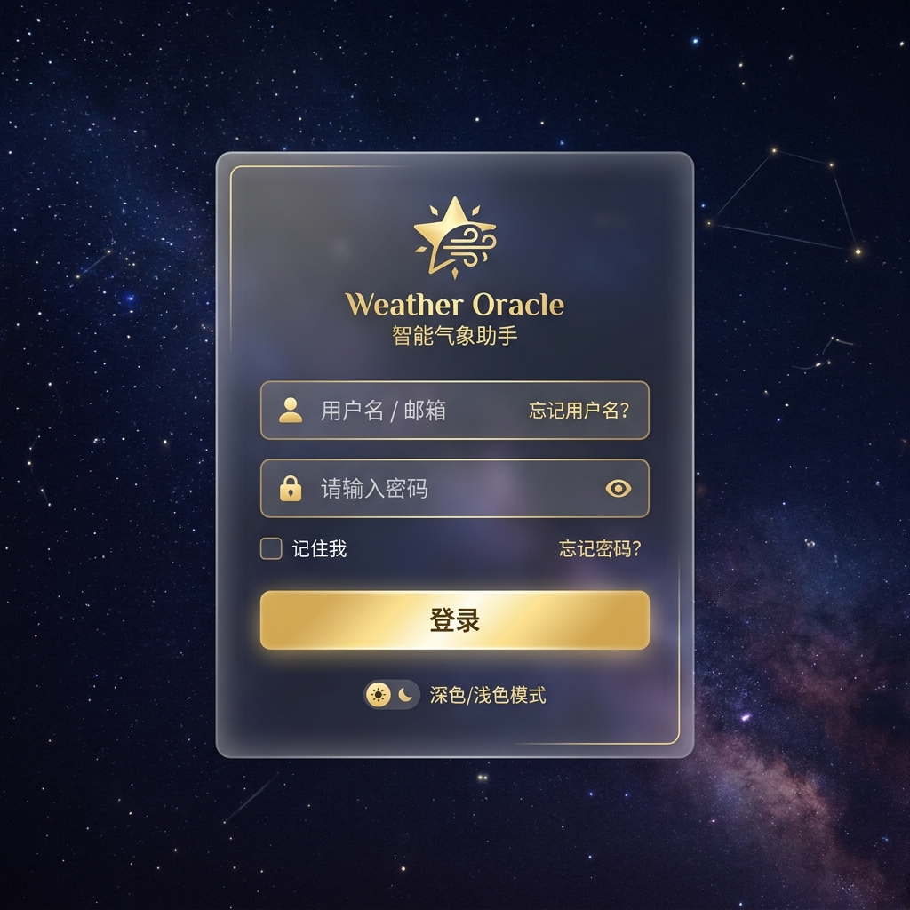

## 大语言模型气象业务应用平台

本项目是一款面向气象业务的大语言模型智能应用平台，采用前后端分离架构。

前端基于 Vue 3 提供智能气象问答对话界面，采用玻璃模糊设计风格；后端采用 Python + LangChain 技术，实现简单的天气检索功能，模型支持流式输出、知识库检索、调用天气工具等。

### 登录页


### 气象助手主页


### 智能气象对话页


### 系统设置页


### 用户管理页


## 核心功能

- **智能对话模型**：支持多轮对话上下文，SSE 流式输出，目前支持 4 个模型
- **知识库**：分别拥有气象术语库、预警信号库，以 SQL 查询注入 Prompt 的方式增强回答
- **天气相关**：天气实时查询（Tavily API）、气象预警查询（QWeather API）
- **对话管理**：支持创建、切换、删除对话、历史消息持久化
- **用户认证**：Session-Cookie 登录认证，支持用户注册
- **用户管理**：管理员可查看用户列表、修改用户权限、删除用户
- **系统设置**：所有用户可在前端页面配置 LLM API Keys 和天气服务参数
- **Markdown**：前端页面支持 Markdown 格式渲染

## 技术栈

- 前端：Vue 3 + Vite + TypeScript
- 后端：Python + LangChain + FastAPI
- 数据库：SQLite（自动初始化，无需安装数据库服务）
- 模型 API 接入：目前支持 Kimi / DeepSeek / MiniMax

## 文件结构

```
./
├── index.html                     # 前端入口 HTML
├── package.json                   # 前端 npm 配置（含 concurrently 脚本）
├── vite.config.ts                 # Vite 构建配置（含 API 代理）
├── tsconfig.app.json              # TypeScript 应用配置
├── openapi.yaml                   # 后端 API 规格（OpenAPI 3.0）
├── README.md                      # 项目说明
├── AGENTS.md                      # AI 编码代理项目入口说明
├── CLAUDE.md                      # Claude 到 AGENTS.md 的桥接文件
│
├── src/                           # 前端源码
│   ├── main.ts                    # 应用入口
│   ├── App.vue                    # 根组件
│   ├── style.css                  # 全局样式（Apple 风格 CSS 变量）
│   ├── api/
│   │   └── weatherOracle.ts       # 气象助手 API 请求
│   ├── components/
│   │   └── oracle/                # 气象助手面板组件
│   │       ├── MoodGuidePanel.vue      # 生活指南面板
│   │       ├── OracleBottomCards.vue   # 底部指标与建议卡片
│   │       ├── OracleChatPanel.vue     # 右侧气象 AI 助理对话
│   │       ├── OracleLeftSidebar.vue   # 快捷入口与每日气象贴士
│   │       ├── QuickCityPicker.vue     # 城市选择器
│   │       ├── TarotCardDisplay.vue    # 今日天气概览卡片
│   │       └── WeatherMetricGrid.vue   # 实时天气数据网格
│   ├── layouts/
│   │   └── OracleLayout.vue       # 气象助手页面布局壳
│   ├── data/
│   │   └── tarotCards.ts          # 塔罗牌/天气卡片静态数据清单
│   ├── router/
│   │   └── index.ts               # 路由配置
│   ├── stores/
│   │   └── auth.ts                # 用户认证状态管理
│   ├── styles/
│   │   └── oracle-theme.css       # 气象助手专有 CSS 主题变量
│   ├── types/
│   │   └── weatherOracle.ts       # 气象助手相关 TypeScript 类型定义
│   ├── utils/
│   │   └── tarot.ts               # 塔罗牌辅助函数
│   ├── views/
│   │   ├── Login.vue              # 登录页
│   │   ├── Register.vue           # 注册页
│   │   ├── WeatherOracle.vue      # 气象助手主页
│   │   ├── Settings.vue           # 系统设置页
│   │   ├── AdminUsers.vue         # 用户管理页（管理员）
│   │   └── IntelligentAssistant.vue   # 智能助手核心页面
│   └── assets/                    # 静态资源
│
├── backend/                       # 后端服务
│   ├── requirements.txt           # Python 依赖清单
│   ├── .env                       # 环境变量配置
│   ├── init.sql                   # SQLite 数据库初始化 SQL
│   ├── database.sqlite            # SQLite 数据库文件（git 忽略）
│   └── app/
│       ├── main.py                # FastAPI 应用入口
│       ├── config.py              # Pydantic Settings 配置
│       ├── database.py            # SQLAlchemy + SQLite 连接（含 PRAGMA 配置）
│       ├── dependencies.py        # 依赖注入
│       ├── init_data.py           # 种子数据初始化
│       ├── models/                # ORM 模型
│       ├── routers/               # API 路由
│       ├── schemas/               # Pydantic 数据模型
│       ├── services/              # 业务服务（LLM、对话、知识库、天气工具及 HTTPX 兼容处理）
│       ├── data/                  # 静态元数据（塔罗牌与天气提示定义）
│       └── core/                  # 工具模块（安全加密、SSE 封装）
│
├── docs/                          # 项目文档
│   ├── project_status.md          # 当前任务状态与下一步
│   ├── agent_workflow.md          # 代理协作与交接流程
│   ├── images/                    # README 截图
│   └── manuals/                   # 导出的用户手册等 PDF（git 忽略）
│
├── scripts/                       # 工具脚本
│   ├── generate-ppt.cjs           # PPT 生成脚本
│   ├── build-ppt.cjs              # PPT 构建脚本
│   ├── check-ppt.py               # PPT 检查脚本
│   └── md-to-html.py              # Markdown 转 HTML 辅助脚本
│
├── public/                        # 静态公共资源
├── dist/                          # 前端生产构建产物（git 忽略）
└── .gitignore
```

## 配置指南

### 数据库

本项目使用 SQLite 数据库，无需安装任何数据库服务。启动时自动创建 `backend/database.sqlite` 并初始化表结构和种子数据。

数据库包含以下 5 张表：

| 表名 | 说明 |
|------|------|
| `users` | 用户表（用户名、bcrypt 密码哈希） |
| `conversations` | 对话表（UUID 主键、用户外键、模型 ID、标题） |
| `messages` | 消息表（角色、内容、工具调用 JSON） |
| `terms` | 气象术语库（术语名、分类、释义、来源） |
| `alerts` | 预警信号库（类型、级别、发布标准、防御指南） |

默认账号：
- 用户名：`admin`
- 密码：`admin123`
- 角色：**管理员**，可访问用户管理页面

### 前端配置（系统设置页面）

除使用 `.env` 文件配置外，也可直接在网页上配置：

| 配置项 | 说明 |
|--------|------|
| Kimi API Key | Kimi 模型 API 密钥 |
| DeepSeek API Key | DeepSeek 模型 API 密钥 |
| MiniMax API Key | MiniMax 模型 API 密钥 |
| Tavily API Key | 天气搜索服务密钥 |
| 和风天气 API Key | 实时预警查询密钥 |
| 和风天气 API Host | 和风天气 API 服务器地址 |

所有已登录用户均可访问系统设置页面，修改配置后即时生效。

### 环境变量（`backend/.env`）

```bash
# 数据库（默认 SQLite，无需修改）
DATABASE_URL=sqlite:///./database.sqlite

# LLM API Keys（至少配置一个）
KIMI_API_KEY=sk-xxxxxxxx
DEEPSEEK_API_KEY=sk-xxxxxxxx
MINIMAX_API_KEY=xxxxxxxx

# 天气搜索（TAVILY）
TAVILY_API_KEY=tvly-xxxxxxxx

# 实时预警（和风天气，可选）
QWEATHER_API_KEY=xxxxxxxx
QWEATHER_API_HOST=kt4up5963t.re.qweatherapi.com

```

前端无需额外配置，Vite 代理自动将 `/api/*` 请求转发到后端 `http://localhost:8000`。

## 启动步骤

### 一键启动（推荐）

```bash
# 安装前端依赖（首次）
npm install

# 同时启动前端 + 后端
npm run dev
```

| 服务 | 地址 |
|------|------|
| 前端 | http://localhost:5173 |
| 后端 | http://localhost:8000 |
| API 文档 | http://localhost:8000/docs |

### 分开启动（可选）

```bash
# 仅启动前端
npm run dev:frontend

# 仅启动后端
npm run dev:backend
```

### 默认账号

- 用户名：`admin`
- 密码：`admin123`
