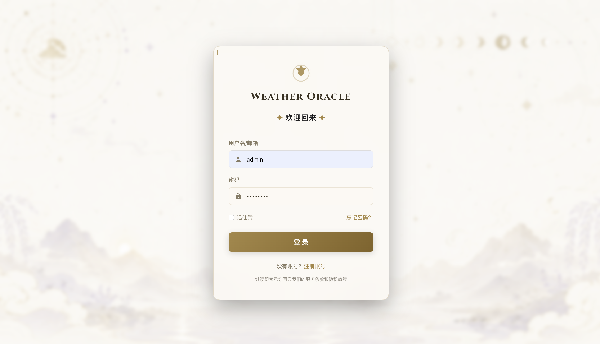
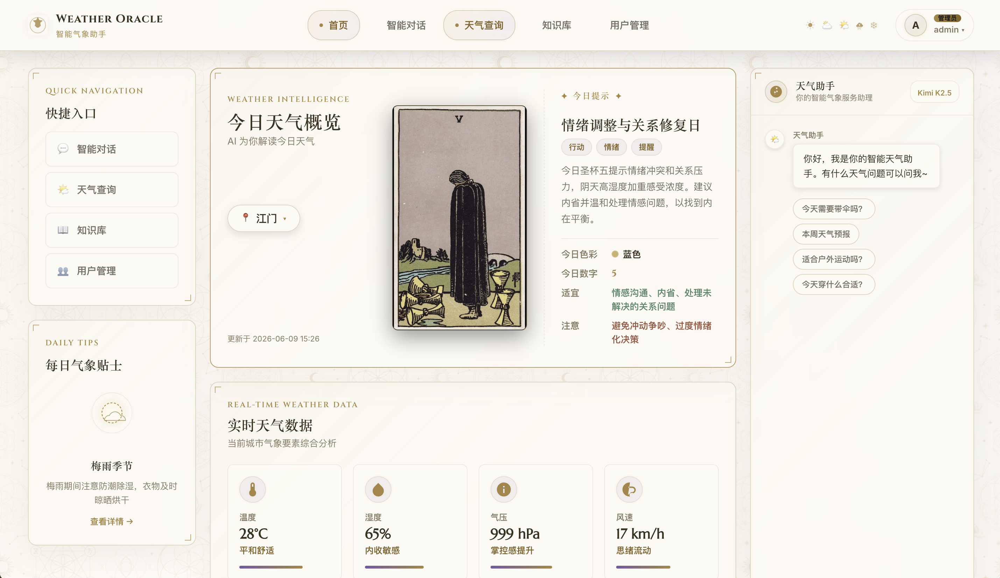
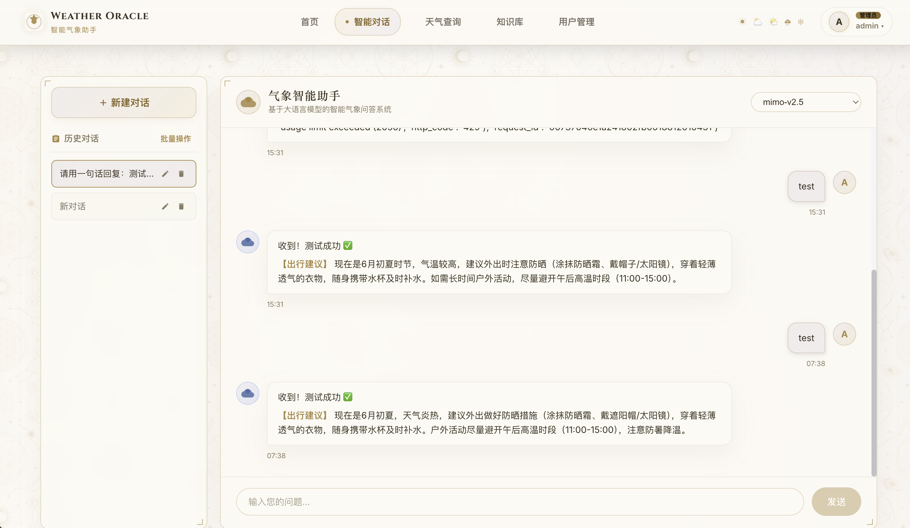
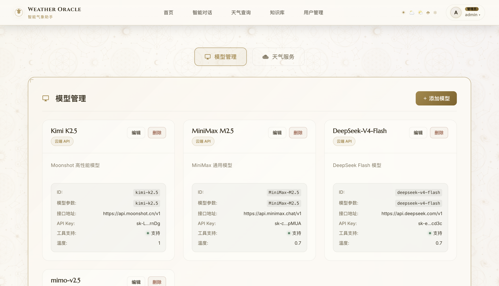
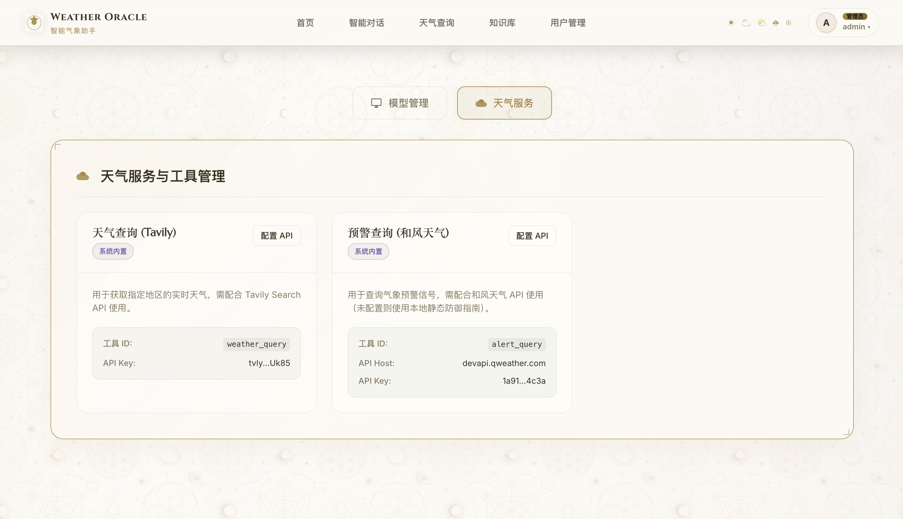
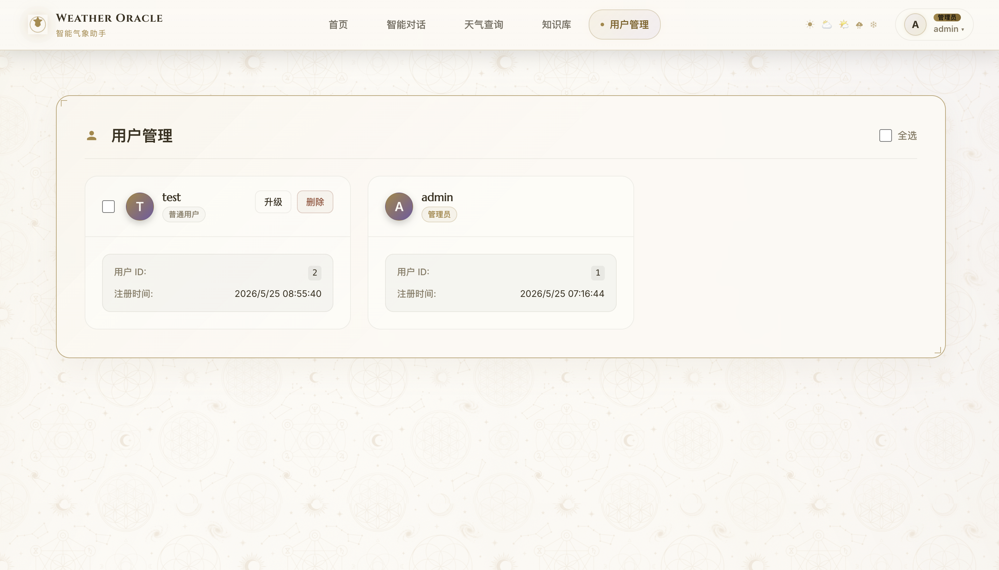

# Weather Oracle 智能气象助手

大语言模型气象业务应用平台，提供登录注册、气象助手主页、智能气象对话、知识库展示、系统设置和用户管理能力。前端使用 Vue 3，后端使用 FastAPI + LangChain，默认使用 SQLite，本地启动后即可自动建表并写入种子数据。

前端通过 Vite `/api` 代理访问后端，后端提供认证、模型配置、天气工具配置、对话、天气卡片、用户管理等 API。

## 页面预览

### 登录页



### 气象助手主页



### 智能气象对话页



### 系统设置页：模型管理



### 系统设置页：天气服务管理



### 用户管理页



## 核心功能

### 账号与权限

- 用户注册、登录、退出。
- Cookie Session 认证，Session 同时保存在内存和 SQLite 中，服务重载后仍可恢复。
- 路由守卫按登录态和管理员权限控制页面访问。
- 默认管理员账号：`admin / admin123`。

### 气象助手主页

- 首次进入默认查询 `广东江门` 天气，也支持切换城市。
- 调用和风天气实时接口获取温度、湿度、气压、风速、风向、天气现象、观测时间。
- 生成每日天气卡片、天气指标解读、出行建议、穿衣建议和生活指南。
- 同一用户同一天保留同一张每日天气卡片，切换城市时只刷新城市天气与建议。
- 页面按用户和上海日期缓存最近一次结果，隔天自动失效。
- 右侧内嵌上下文对话，可带入当前城市和天气卡片信息提问。

### 智能气象对话

- 支持多模型切换，模型列表来自后端配置。
- SSE 流式输出。
- 支持 Markdown 渲染，并通过 DOMPurify 过滤 HTML。
- 支持历史对话列表、新建对话、切换对话、删除对话、批量删除。
- 支持 AI 自动总结对话标题。
- 可结合气象术语库、预警信号库和天气/预警工具回答。
- 对支持工具调用的模型，可绑定天气查询和预警查询工具；不支持工具调用的模型会用提示词方式补充工具说明。

### 知识库

- 后端内置气象术语库和预警信号库种子数据，用于对话 Prompt 增强。
- 前端提供知识库展示页，可搜索和筛选静态知识文章。

### 系统设置

- 管理员可在页面管理模型配置：
  - 模型 ID、显示名称、接口模型名、Base URL、API Key、temperature。
  - 是否支持工具调用。
  - 是否为 Ollama 兼容本地模型。
- 管理员可在页面管理天气工具配置：
  - `weather_query`：天气查询工具。
  - `alert_query`：和风天气预警工具。
- API Key 在页面中只显示掩码值。

### 用户管理

- 管理员可查看用户列表。
- 支持单个用户升级为管理员、降级为普通用户、删除用户。
- 支持批量选择、批量升级、批量降级、批量删除。
- 默认 `admin` 用户不可被删除。

### 天气与预警工具

- 和风天气结构化实时天气查询。
- 和风天气预警查询。
- 未配置实时预警服务时，可回退到本地预警信号标准定义。
- 天气查询工具可按问题推断城市和天数；多日查询最多限制为 7 天。
- 集成 Tavily Search 作为天气检索备选来源。

## 技术栈

| 层 | 技术 |
| --- | --- |
| 前端框架 | Vue 3、Vite、TypeScript |
| 状态与路由 | Pinia、Vue Router |
| 富文本渲染 | marked、DOMPurify |
| 后端框架 | FastAPI、Uvicorn |
| LLM 编排 | LangChain、langchain-openai、langchain-tavily |
| 数据库 | SQLite、SQLAlchemy |
| 认证 | bcrypt、Cookie Session |
| HTTP 客户端 | httpx |
| 外部服务 | Kimi、MiniMax、DeepSeek、Ollama 兼容接口、Tavily、QWeather |

## 文件结构

```text
.
├── README.md
├── AGENTS.md
├── index.html
├── package.json
├── vite.config.ts
├── tsconfig.json
├── tsconfig.app.json
├── tsconfig.node.json
├── openapi.yaml
├── src
│   ├── main.ts
│   ├── App.vue
│   ├── api
│   │   └── weatherOracle.ts
│   ├── components
│   │   └── oracle
│   │       ├── MoodGuidePanel.vue
│   │       ├── OracleBottomCards.vue
│   │       ├── OracleChatPanel.vue
│   │       ├── OracleLeftSidebar.vue
│   │       ├── QuickCityPicker.vue
│   │       ├── TarotCardDisplay.vue
│   │       └── WeatherMetricGrid.vue
│   ├── data
│   │   └── tarotCards.ts
│   ├── layouts
│   │   └── OracleLayout.vue
│   ├── router
│   │   └── index.ts
│   ├── stores
│   │   └── auth.ts
│   ├── styles
│   │   └── oracle-theme.css
│   ├── types
│   │   └── weatherOracle.ts
│   ├── utils
│   │   └── tarot.ts
│   └── views
│       ├── AdminUsers.vue
│       ├── IntelligentAssistant.vue
│       ├── KnowledgeBase.vue
│       ├── Login.vue
│       ├── Register.vue
│       ├── Settings.vue
│       └── WeatherOracle.vue
├── backend
│   ├── requirements.txt
│   ├── init.sql
│   ├── app
│   │   ├── main.py
│   │   ├── config.py
│   │   ├── database.py
│   │   ├── dependencies.py
│   │   ├── init_data.py
│   │   ├── core
│   │   │   ├── security.py
│   │   │   └── sse.py
│   │   ├── data
│   │   │   └── tarot_cards.py
│   │   ├── models
│   │   ├── routers
│   │   ├── schemas
│   │   └── services
│   └── tests
│       ├── test_assistant_defaults.py
│       ├── test_batch_users.py
│       ├── test_llm_config.py
│       ├── test_security_regressions.py
│       ├── test_weather_card.py
│       └── test_weather_tool.py
├── public
│   ├── favicon.svg
│   ├── mystical_bg_dark.png
│   ├── mystical_bg_light.png
│   └── tarot
│       └── cards
├── docs
│   ├── images
│   ├── manuals
│   ├── project_status.md
│   └── agent_workflow.md
└── scripts
    ├── check-ppt.py
    ├── generate-ppt.cjs
    ├── build-ppt.cjs
    └── md-to-html.py
```

## 主要路由

| 路由 | 页面 | 权限 |
| --- | --- | --- |
| `/login` | 登录页 | 游客 |
| `/register` | 注册页 | 游客 |
| `/oracle` | 气象助手主页 | 登录用户 |
| `/intelligent-assistant` | 智能气象对话 | 登录用户 |
| `/knowledge-base` | 知识库展示 | 登录用户 |
| `/settings` | 系统设置 | 管理员 |
| `/admin/users` | 用户管理 | 管理员 |

`/home` 会跳转到 `/oracle`，根路径 `/` 会跳转到 `/login`。

## API 概览

| 模块 | 接口 |
| --- | --- |
| 认证 | `POST /api/v1/auth/register`、`POST /api/v1/auth/login`、`POST /api/v1/auth/logout`、`GET /api/v1/auth/me` |
| 对话 | `GET /api/v1/assistant/models`、`POST /api/v1/assistant/chat/stream`、`GET/POST/PUT/DELETE /api/v1/assistant/conversations...` |
| 天气卡片 | `POST /api/v1/assistant/weather-card` |
| 知识和工具清单 | `GET /api/v1/assistant/knowledge-bases`、`GET /api/v1/assistant/tools` |
| 全局配置 | `GET /api/v1/config/`、`PUT /api/v1/config/` |
| 模型配置 | `GET/POST /api/v1/config/models/`、`PUT/DELETE /api/v1/config/models/{model_id}` |
| 天气工具配置 | `GET /api/v1/config/tools/`、`PUT /api/v1/config/tools/{tool_id}` |
| 用户管理 | `GET /api/v1/users/`、`PUT/DELETE /api/v1/users/{user_id}`、`POST /api/v1/users/batch/admin`、`POST /api/v1/users/batch/delete` |

启动后可打开 `http://localhost:8000/docs` 查看交互式 API 文档。

## 配置指南

### 环境变量

后端会读取 `backend/.env`。可从示例文件复制：

```bash
cp backend/.env.example backend/.env
```

可用配置：

| 变量 | 说明 | 默认值 |
| --- | --- | --- |
| `DATABASE_URL` | SQLite 连接地址 | `sqlite:///./database.sqlite` |
| `KIMI_API_KEY` | Kimi API Key | 空 |
| `DEEPSEEK_API_KEY` | DeepSeek API Key | 空 |
| `MINIMAX_API_KEY` | MiniMax API Key | 空 |
| `TAVILY_API_KEY` | Tavily Search API Key | 空 |
| `QWEATHER_API_KEY` | 和风天气 API Key | 空 |
| `QWEATHER_API_HOST` | 和风天气 API Host | `devapi.qweather.com` |
| `OLLAMA_BASE_URL` | Ollama 兼容接口地址 | `http://localhost:11434/v1` |
| `APP_SECRET_KEY` | 应用密钥预留项 | `change-me` |
| `ALLOWED_ORIGINS` | 后端 CORS 来源 | `http://localhost:5173` |

前端默认不需要单独配置。`vite.config.ts` 会把 `/api/*` 转发到 `http://localhost:8000`。

### 数据库

项目默认使用 SQLite，无需单独安装数据库服务。后端启动时会自动创建表并写入种子数据。

当前主要数据表：

| 表 | 说明 |
| --- | --- |
| `users` | 用户、密码哈希、管理员标记 |
| `sessions` | 登录 Session 持久化 |
| `conversations` | 对话元数据 |
| `messages` | 对话消息 |
| `terms` | 气象术语库 |
| `alerts` | 预警信号标准与防御指南 |
| `model_configs` | LLM 模型配置 |
| `tool_configs` | 天气工具配置 |

默认种子数据包含：

- 管理员：`admin / admin123`
- 模型：Kimi K2.5、MiniMax M2.5、DeepSeek-V4-Flash、DeepSeek R1 14B 本地模型
- 工具：天气查询、预警查询
- 气象术语与预警信号示例数据

### 模型配置

可以用两种方式配置模型密钥：

1. 写入 `backend/.env`。
2. 登录管理员账号后，在系统设置页面添加或编辑模型。

模型配置优先读取数据库中的页面配置；如果数据库中的 API Key 为空，会回退到 `.env` 对应变量。

### 天气服务配置

- 实时天气与天气卡片依赖和风天气 `QWEATHER_API_KEY`。
- 对话里的天气查询工具可使用和风天气结构化接口，也可使用 Tavily 作为备选。
- 预警查询未配置和风天气时，会返回本地预警信号标准定义。

## 启动步骤

### 1. 安装前端依赖

```bash
npm install
```

### 2. 安装后端依赖

```bash
cd backend
python3 -m pip install -r requirements.txt
cd ..
```

### 3. 一键启动前后端

```bash
npm run dev
```

服务地址：

| 服务 | 地址 |
| --- | --- |
| 前端 | `http://localhost:5173` |
| 后端 | `http://localhost:8000` |
| API 文档 | `http://localhost:8000/docs` |

如果 `5173` 已被占用，Vite 会自动换到下一个可用端口，以终端输出为准。

### 4. 分开启动

```bash
# 前端
npm run dev:frontend

# 后端
npm run dev:backend
```

也可以手动启动后端：

```bash
cd backend
python3 -m uvicorn app.main:app --reload --port 8000
```

## 常用命令

```bash
# 前端类型检查和打包校验
npm run build

# 后端测试
cd backend
python3 -m pytest
```

## 常见问题

### 登录失败或页面提示 Failed to fetch

先检查后端是否在 `8000` 端口运行：

```bash
curl http://localhost:8000/health
```

如果前端请求 `/api` 返回 `502 Bad Gateway`，通常是后端没有启动。

### 用户管理页无法加载

用户列表接口需要访问 `/api/v1/users/`。少了末尾 `/` 会触发 FastAPI 重定向，在某些开发端口下可能被浏览器拦截。

### 本地模型无法回复

如果使用 Ollama 兼容模型，请确认本地服务已启动，并且 `OLLAMA_BASE_URL` 指向正确端口。默认值是：

```bash
http://localhost:11434/v1
```

## 安全说明

- 不要提交 `backend/.env`、SQLite 数据库文件、API Key、Cookie、运行日志。
- `.gitignore` 已忽略本地数据库、日志、`dist/`、`node_modules/`、虚拟环境等文件。
- README 截图位于 `docs/images/`。
